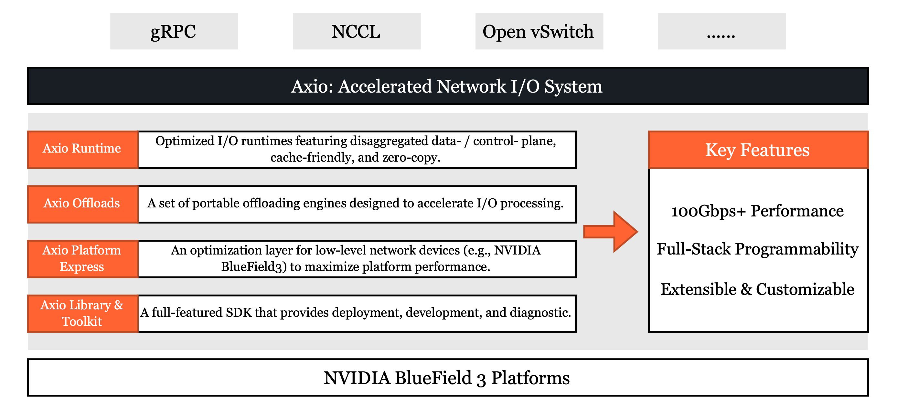

# Axio: Accelerated Network I/O Project

**Axio** aims to construct a **high-performance**, **programmable**, and **extensible** network I/O system with modern DPU acceleration (e.g., NVIDIA BlueField 3). 
It provides an integrated set of runtime engines, portable offloads, platform optimizations, and user-space libraries to support 100Gbps+ network I/O performance.

---

## Key Features

| Feature | Description |
|---------|-------------|
| **High Performance** | Optimized for 100Gbps+ throughput and microsecond-scale I/O performance. |
| **Programmable** | Enables full-stack programmability across I/O interfaces, transport protocols, and offload pipelines. |
| **Extensible & Customizable** | Modular system design allows easy integration of new runtimes, offloads, and platform features. |

---

## Axio Overview & Roadmap

---

## Project Layout 
As illustrated in the architecture overview, Axio spans across DPU, CPU, and GPU, and integrates a variety of features and components to enable a full-stack, high-performance network I/O system.

We provide **two main repositories** for users to deploy the Axio system:
- **`axio-host`**: Contains the user-space Axio libraries, encapsulates low-level integration with the DPU, and provides interfaces to third-party systems such as gRPC, Open vSwitch, NCCL, etc. This repository is intended to be deployed on the **host side** (CPU or GPU).
- **`axio-dpu`**: Contains the Axio runtime, offload modules, and platform-level optimizations (Platform Express). This repository is intended to run on the **DPU side** (currently targeting **NVIDIA BlueField-3** only).

To facilitate modular development and testing, we maintain each **Axio feature or function** in a separate repository. These standalone modules include minimal test infrastructure (e.g., integration with traffic generators or emulators) to allow contributors to develop and verify individual components independently, without needing the full Axio system.

Once a module becomes stable, it will be merged into `axio-host` or `axio-dpu` for production use.

### Current Modules

| Axio Component         | Module        | Description                                               | Status                                     |
|------------------------|---------------|-----------------------------------------------------------|--------------------------------------------|
| **Runtime**            | `CEIO`        | Cache-efficient, DPU-driven I/O runtime                   | Accepted at SIGCOMM'25 🛠️ Pending integration |
|                        | `DCP`         | Disaggregated data/control-plane RDMA engine              | Accepted at SIGCOMM'25 🛠️ Pending integration |
|                        | `RhyR`        | Congestion control for high-throughput I/O                | Accepted at APNet'25 🛠️ In development |
| **Platform Express**   | `axio-bf3`     | Development framework for NVIDIA DOCA & BlueField-3      | 🛠️ In development                            |
| **Library & Toolkit**  | `axio-emulator`| 400Gbps test loader and datapath emulator                | 🛠️ In development                            |
|                        | `FuseLink`    | Multi-NIC GPU communication library                       | Accepted at OSDI'25 🛠️ Pending integration |

---

## Supported Libraries & Frameworks (TBD)

---

## Contact

Axio is an open project under active development.  
We welcome contributions, collaborations, and discussions with the community.

- Open an issue or pull request on GitHub
- Contact the maintainers via email for institutional partnerships
